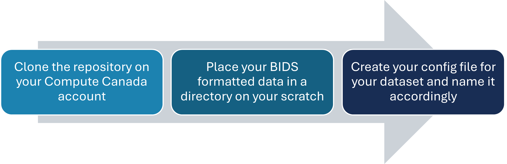

#     ChronicPainfMRI  
**ChronicPainfMRI** is a repository that aims to facilitate the reproduction of the fMRI preprocessing we did in our lab, on different datasets. It contains code to easily run the same pipelines we normally use and with the same options. One of the strong points of this repository is that it allows to easily run fmriprep on longitudinal data.

For longitudinal data, we run Freesurfer beforehand and organize the output so that fmriprep can use the outputs that correspond to the right session. For cross-sectionnal data, fmriprep is usually easier to run and it is not necessary to run Freesurfer seperately beforehand, but it's still possible to use the code in this repository.

The dataset we originally used to develop this repository includes 27 chronic low back pain patients and 25 controls scanned at three timepoints (0, 2, and 4 months) between April 2021 and July 2022. For detailed dataset and acquisition information, refer to our [dataset documentation](https://github.com/Tetreault-Pain-Imaging-Lab/dataset_LongitudinalNoTreatement).


## Repository Usage             

   
   
### Forking the Repository for personal use
If you would like to use and customize this repository for your own purposes, we recommend forking it. Forking allows you to have your own version of this project that you can modify and maintain independently of the original codebase. Here’s how you can fork this repository:

Create a Fork: Simply click the “Fork” button at the top-right corner of this repository's GitHub page. This action will create a copy of this repository in your own GitHub account.

Clone Your Fork: After forking, clone the forked repository to your local machine to make your changes. You can do this by running:

```bash
git clone https://github.com/YOUR-USERNAME/YOUR-REPOSITORY
```

You could also simply clone this repository on your Compute Canada account and start using it directly, which is fine if you want to customize it but you don't want multiple versions of this repository

### Running on Compute Canada

To use this repository on Compute Canada, here's some helpful guidance:
- **Data Management**: Place your data in the scratch directory, run scripts there, and transfer results elsewhere only after processing.
    
- **Tool Installation**: Install tools like `fmriprep` and `freesurfer` in a persistent directory (e.g., *projects* directory). Use the `install_tools_cc.sh` to install them in one step.

- **Ressources allocation**:When submitting jobs on a cluster, you have to allocate ressources trough the SLURMS parameters. To monitor jobs and see what ressources it uses, Narval and Beluga have a portal that helps you visualise ressources usage for tasks :[Narval](https://portail.narval.calculquebec.ca), [Beluga](https://portail.beluga.calculquebec.ca).
Portals for the other clusters might be available now.

         ### SLURM Parameters Info
         
         - **--nodes**: Number of nodes to allocate. Generally depends on the number of subjects and available cores per task.  
           If you have more subjects than cores (e.g., 38 subjects and 32 cpus-per-task), consider requesting an additional node.
         
         - **--cpus-per-task**: Number of CPUs to allocate per task. Choose based on your cluster's available configurations.  
           For example, Beluga allows 32, 40, or 64 CPUs per task.  
           More information: [Beluga Node Characteristics](https://docs.computecanada.ca/wiki/B%C3%A9luga/en#Node_Characteristics)
         
         - **--mem**: Memory allocation per node. Setting this to 0 allocates all available memory on the node.  
           Adjust based on expected memory usage.
         
         - **--time**: Maximum job runtime. Adjust based on your pipeline's expected duration.
         
         - **--mail-user**: Email address for job notifications.
         
         - **--mail-type**: Conditions under which to send job status emails (BEGIN, END, FAIL, REQUEUE, ALL).
         
         - **--output**: Path to the output log file for the SLURM job. `%A` is the job ID.

     For more info on how to run jobs on Compute Canada see their [wiki page](https://docs.alliancecan.ca/wiki/Running_jobs)


## Config file
To run the anlysis on a new dataset, you need to create your config file. In this file you will set all the variables that the pipelines need to run on a new dataset. Use the `config_ex.sh` file as a template. Here is all the variables you need to set in this file :

| **Variable**           | **Description**                                                                                                                               |
|------------------------|-----------------------------------------------------------------------------------------------------------------------------------------------|
| `REPOS_DIR`            | Path where the ChronicPainDWI repository is installed/cloned on your Compute Canada account.                                                  |
| `TOOLS_PATH`           | Directory containing tools like the sclilus lab container and nextflow tools. Recommended to place in `/user/projects` to prevent purging.   |
| `BIDS_DIR`             | Path to the raw BIDS formatted dataset. Contains subject folders and essential files like `participants.tsv`, `participants.json`, and `dataset_description.json`. |
| `OUTPUT_DIR`           | Directory where results are stored, organized by the pipeline that generated them. (i.e. tractoflow outputs will be placed in `$OUTPUT_DIR/tractoflow`)                                                         |
| `LICENSE_FILE`   | Path to your Freesurefer license file. Needed for Freesurfer and fmriprep. To get yours, register [here](https://surfer.nmr.mgh.harvard.edu/registration.html)   |
| `longitudinal` | If your dataset is cross-sectionnal, set to false. | 
| `SESSIONS` | The session labels of your longitudinal data in a space separeted list (i.e. `SESSIONS=("v1" "v2" "v3")`. You can comment this for cross-sectionnal data.  |
| `N_SESSIONS` | Number of sessions in your data. You can comment this for cross-sectionnal data. You can comment this for cross-sectionnal data. |
| `MAIL`                 | Email address for job notifications. Optional; remove `#SBATCH --mail` lines if not needed.                                                  |
| `SLURM_OUT`            | Path for storing SLURM job output logs.                                                                                                       |
| `fmriprep_ressources`| SLURM parameters for the `run_fmriprep_cc.sh` script, including job name, time, nodes, CPUs per task, memory, output log path, and email notifications. |
| `freesurfer_ressources` |  SLURM parameters for the `run_freesurfer_cc.sh` script   |


Creating multiple config file with evocative names can allow you to quickly switch between two dataset or two configurations of your data without changing anything in the other scripts. After creating this file you can run any other script of this repository this way:

```bash
bash some_script_path your_config_file_path
```
If you only use one config file you can name it `config_ex.sh`, since it is the file that will be used as default if no config file is specified as argument when calling a script. Or you could change the `DEFAULT_CONFIG_FILE="config_ex.sh" ` line in all the scripts to use your config file by default.


